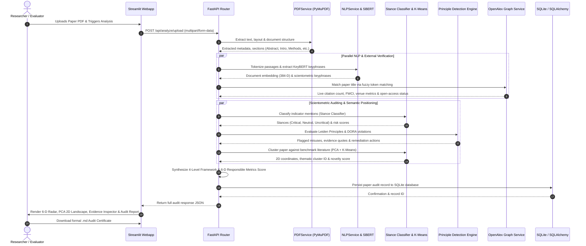

# ResponsibleMetrics AI: End-to-End System Workflow

> **An NLP-Based Multi-Level Framework for Responsible Use of Bibliometric Indicators**  
> *Comprehensive Technical Architecture, Data Pipeline, and Operational Workflow Specification*

---

## 📑 Table of Contents

1. [High-Level Architectural Overview](#1-high-level-architectural-overview)
2. [End-to-End Workflow Diagram](#2-end-to-end-workflow-diagram)
3. [Detailed Phase-by-Phase Pipeline](#3-detailed-phase-by-phase-pipeline)
   - [Phase 1: Ingestion & Document Decomposition](#phase-1-ingestion--document-decomposition)
   - [Phase 2: Semantic NLP & Keyphrase Extraction](#phase-2-semantic-nlp--keyphrase-extraction)
   - [Phase 3: Bibliometric Stance & Misuse Classification](#phase-3-bibliometric-stance--misuse-classification)
   - [Phase 4: Leiden & DORA Rule Engine Auditing](#phase-4-leiden--dora-rule-engine-auditing)
   - [Phase 5: Real-Time Scholarly Graph Grounding (OpenAlex)](#phase-5-real-time-scholarly-graph-grounding-openalex)
   - [Phase 6: Semantic Clustering & Frontier Novelty Projection](#phase-6-semantic-clustering--frontier-novelty-projection)
   - [Phase 7: 4-Level Framework & 6-D Metric Synthesis](#phase-7-4-level-framework--6-d-metric-synthesis)
   - [Phase 8: Data Persistence, Dashboard & Report Generation](#phase-8-data-persistence-dashboard--report-generation)
4. [Component Interaction & Data Flow Map](#4-component-interaction--data-flow-map)
5. [Database Schema & Entity Lifecycle](#5-database-schema--entity-lifecycle)
6. [API Endpoint Workflow Reference](#6-api-endpoint-workflow-reference)

---

## 1. High-Level Architectural Overview

ResponsibleMetrics AI operates on a modern decoupled architecture consisting of an asynchronous **FastAPI** backend, deep NLP/ML evaluation pipelines, external scholarly graph APIs, and an interactive **Streamlit** multi-page analytical dashboard.

```
┌────────────────────────────────────────────────────────────────────────┐
│                        FRONTEND PRESENTATION LAYER                     │
│  - Streamlit UI (1_Analyze_Paper, 2_Dashboard, 3_History, 4_Report)    │
│  - Interactive Plotly Visualizations (Radar, PCA 2D Scatter, Meters)   │
└───────────────────────────────────┬────────────────────────────────────┘
                                    │ HTTP REST API (Multipart / JSON)
┌───────────────────────────────────▼────────────────────────────────────┐
│                        BACKEND API & ORCHESTRATION                     │
│  - FastAPI Router (`app/routers/paper_analysis.py`)                    │
│  - Dependency Injection, Safe JSON Serialization, Database Session     │
└───────┬───────────────────────────┬────────────────────────────┬───────┘
        │                           │                            │
┌───────▼───────────────┐   ┌───────▼────────────────┐   ┌───────▼───────┐
│ DOCUMENT EXTRACTION   │   │ NLP & MACHINE LEARNING │   │ EXTERNAL APIS │
│ - PyMuPDF (fitz)      │   │ - SBERT (all-MiniLM)   │   │ - OpenAlex API│
│ - Section Classifiers │   │ - KeyBERT Keyphrases   │   │   (Live Graph │
│ - Regex Indicator Scan│   │ - Stance Classifier    │   │    Telemetry) │
└───────────────────────┘   │ - K-Means & PCA (2D)   │   └───────────────┘
                            └────────────────────────┘
```

---

## 2. End-to-End Workflow Diagram

The sequence below illustrates the chronological lifecycle of an audit request from raw PDF ingestion to final audit certificate export:



---

## 3. Detailed Phase-by-Phase Pipeline

### Phase 1: Ingestion & Document Decomposition
* **Target File**: `backend/app/services/pdf_service.py`
* **Inputs**: Binary `.pdf` stream via HTTP POST.
* **Process**:
  1. Temporary storage buffer created with unique SHA-256 hash checking to prevent redundant parsing.
  2. `fitz.open()` (PyMuPDF) traverses font sizes, line weights, and layout geometry.
  3. Header-rule heuristics segment unstructured text into discrete canonical sections:
     * **Front Matter**: Title, Authors, Affiliations.
     * **Structural Sections**: Abstract, Introduction, Literature Review, Methodology, Results, Discussion, Conclusion.
     * **Back Matter**: References, Acknowledgments, Conflict of Interest.
* **Outputs**: Structured section dictionary `{section_name: text_content}`.

---

### Phase 2: Semantic NLP & Keyphrase Extraction
* **Target Files**: `backend/app/services/nlp_service.py`, `backend/app/ml/embeddings.py`
* **Process**:
  1. **Discourse Segmentation**: Text is tokenized into sentence-level units with bibliometric term masking.
  2. **Dense Vector Representation**: The `EmbeddingService` generates 384-dimensional dense vectors using the pre-trained `sentence-transformers/all-MiniLM-L6-v2` model.
  3. **Scientometric Keyphrase Extraction**: KeyBERT extracts unigrams, bigrams, and trigrams using maximal marginal relevance (MMR) against document vectors to isolate domain concepts (e.g., *Field-Weighted Citation Impact*, *h-index inflation*, *Citation Cartels*).
* **Outputs**: Sentence candidate lists, dense document vector, and ranked keyphrase list.

---

### Phase 3: Bibliometric Stance & Misuse Classification
* **Target File**: `backend/app/ml/classifier.py` (`MetricStanceClassifier`)
* **Process**:
  1. The engine scans sentences containing mentions of metrics (*citation count*, *h-index*, *impact factor*, *acceptance rate*).
  2. Each sentence vector is evaluated against precomputed exemplar matrices:
     * $\text{Sim}(\vec{s}, \mathbf{M}_{\text{CRITICAL\_AWARE}})$
     * $\text{Sim}(\vec{s}, \mathbf{M}_{\text{NEUTRAL\_DESCRIPTIVE}})$
     * $\text{Sim}(\vec{s}, \mathbf{M}_{\text{UNCRITICAL\_RELIANCE}})$
  3. Cosine similarities are ranked, and mean scores across top exemplars are calculated.
  4. Heuristic lexical tilt rules apply confidence adjustments (e.g., +0.15 for awareness keywords like *"limitation"*, *"flawed"*, *"dora"*; +0.20 for misuse keywords like *"cutoff"*, *"solely based on"*).
* **Outputs**: Stance classification (`CRITICAL_AWARE`, `NEUTRAL_DESCRIPTIVE`, `UNCRITICAL_RELIANCE`), confidence value ($0.0 - 1.0$), and associated risk level.

---

### Phase 4: Leiden & DORA Rule Engine Auditing
* **Target Files**: `backend/app/rules/responsible_metrics_rules.py`, `backend/app/services/principle_detection_service.py`
* **Process**:
  1. Runs deterministic regex pattern matching and semantic proximity matching for known violations:
     * **`MISUSE_JIF_INDIVIDUAL`**: Journal Impact Factor applied to assess an individual or paper (violates DORA 1 & Leiden 7).
     * **`MISUSE_UNNORMALIZED_COMPARISON`**: Raw citation comparison across disciplines without normalization (violates Leiden 6).
     * **`MISUSE_HINDEX_CUTOFF`**: Strict thresholding of h-index for hiring or tenure (violates Leiden 7).
     * **`MISUSE_FALSE_PRECISION`**: Reporting indicators to excessive decimal precision (violates Leiden 8).
  2. Checks for compliance with Leiden Principles 1 to 10 and DORA 1 to 3.
  3. Generates actionable remediation strategies for every detected issue.
* **Outputs**: Identified violations, exact sentence citations, principle compliance indices, and prioritized remediation actions.

---

### Phase 5: Real-Time Scholarly Graph Grounding (OpenAlex)
* **Target File**: `backend/app/services/openalex_service.py`
* **Process**:
  1. Extracts sanitized paper title and primary authors.
  2. Calls OpenAlex Works API endpoint (`https://api.openalex.org/works?filter=title.search:...`).
  3. Applies fuzzy token-sort ratio disambiguation to ensure precise entity matching.
  4. Fetches live academic metadata:
     * Live citation count and historical citation trend.
     * Open-Access status (Gold, Green, Hybrid, Closed).
     * Publication venue metrics, concepts, and primary subject classification.
* **Outputs**: Grounded real-world scholarly telemetry object.

---

### Phase 6: Semantic Clustering & Frontier Novelty Projection
* **Target Files**: `backend/app/ml/clustering.py`, `backend/app/services/research_gap_service.py`
* **Data Source**: `backend/data/literature/sample.jsonl`
* **Process**:
  1. Loads benchmark corpus of scientometric and academic literature.
  2. Embeds target paper title/abstract alongside corpus papers into 384-dimensional space.
  3. Fits **K-Means clustering** ($k=3$ default) on benchmark vectors to define thematic clusters.
  4. Fits **Principal Component Analysis (PCA)** to project 384-D vectors into a 2D Cartesian coordinate plane $(x, y)$.
  5. Computes target paper Euclidean distance to the nearest cluster centroid:
     $$\text{Novelty Score} = \min(1.0, \|\vec{v}_{\text{target}} - \vec{c}_{\text{nearest}}\|)$$
* **Outputs**: 2D coordinate map, thematic cluster tags, cluster distribution, and semantic novelty index.

---

### Phase 7: 4-Level Framework & 6-D Metric Synthesis
* **Target Files**: `backend/app/services/multi_level_framework_service.py`, `backend/app/services/responsible_metrics_service.py`
* **Process**:
  1. Aggregates data into the 4 assessment tiers:
     * **Level 1**: Indicator Level (Diversity, limitations awareness).
     * **Level 2**: Researcher Level (Career stage, narrative qualitative portfolio).
     * **Level 3**: Institutional Level (Field-weighted normalization).
     * **Level 4**: Policy Level (Open data, Goodhart gaming safeguards).
  2. Calculates the 6-Dimension Responsible Metrics Score matrix (0 to 100):
     * *Multi-Indicator Diversity*
     * *Disciplinary Context*
     * *Field Normalization*
     * *Transparency & Open Data*
     * *Gaming Safeguards*
     * *Qualitative Primacy*
* **Outputs**: Composite Responsible Index, Level 1–4 status reports, and radar chart metrics.

---

### Phase 8: Data Persistence, Dashboard & Report Generation
* **Target Files**: `backend/app/routers/paper_analysis.py`, `frontend/pages/`
* **Process**:
  1. Serializes complete analysis dictionary into SQLite through SQLAlchemy (`responsible_metrics.db`).
  2. Streamlit frontend fetches analysis data and dynamically renders:
     * **Radar Chart**: 6-D responsible indicators.
     * **PCA Scatter Plot**: Thematic literature space with target paper positioning.
     * **Evidence Inspector**: Sentence-level highlight cards showing exact text from the PDF.
     * **Formal Audit Certificate**: Downloadable `.md` export containing audit scores, citations, and remediation steps.

---

## 4. Component Interaction & Data Flow Map

```
[Uploaded PDF]
       │
       ▼
 [PDFService] ──────────► [Extracted Sections & Text]
                                │
          ┌─────────────────────┼─────────────────────┐
          │                     │                     │
          ▼                     ▼                     ▼
   [NLPService]         [Classifier ML]      [Principle Detection]
   - KeyBERT             - Cosine Exemplars   - Leiden 1-10
   - Sentence Parsing    - Stance Prediction  - DORA 1-3
          │                     │            - Misuse Rules
          │                     │                     │
          └─────────────────────┼─────────────────────┘
                                │
                                ▼
                   [ResearchClusteringService]
                   - Benchmark sample.jsonl
                   - K-Means Thematic Clusters
                   - PCA 2D Reduction & Novelty
                                │
                                ▼
                 [OpenAlex Scholarly Graph API]
                 - Live Citations & Open Access
                                │
                                ▼
               [Multi-Level Framework Synthesis]
               - 4-Tier Assessment (Level 1-4)
               - 6-D Responsible Metrics Score
                                │
                                ▼
                [SQLAlchemy / SQLite Storage]
                                │
                                ▼
             [Streamlit Interactive UI & Export]
```

---

## 5. Database Schema & Entity Lifecycle

The SQLite relational table `papers` tracks analyzed documents across sessions:

| Column | Type | Description |
| :--- | :--- | :--- |
| `id` | `Integer` | Primary Key (Autoincrementing) |
| `filename` | `String` | Original name of uploaded PDF file |
| `title` | `String` | Extracted or disambiguated paper title |
| `authors` | `Text` | JSON-serialized author list |
| `abstract` | `Text` | Extracted abstract text |
| `year` | `Integer` | Publication year |
| `responsible_score` | `Float` | Composite Responsible Metrics Index (0-100) |
| `analysis_json` | `Text` | Full serialized JSON payload of the multi-phase audit |
| `created_at` | `DateTime` | Timestamp of audit execution |

---

## 6. API Endpoint Workflow Reference

| Method | Endpoint | Description | Consumes / Produces |
| :--- | :--- | :--- | :--- |
| `POST` | `/api/analyze/upload` | Main analysis pipeline. Ingests PDF, executes all ML/NLP models, and stores result. | `multipart/form-data` ➔ `application/json` |
| `GET` | `/api/history/` | Returns list of all previously analyzed papers with summary scores. | None ➔ `application/json` |
| `GET` | `/api/history/{id}` | Retrieves full audit results, 6-D scores, and remediation recommendations for a specific paper. | URL param ➔ `application/json` |
| `DELETE`| `/api/history/{id}` | Deletes a paper record and its audit history from the database. | URL param ➔ `application/json` |
| `GET` | `/health` | Service health check endpoint. | None ➔ `{"status": "healthy"}` |

---

*ResponsibleMetrics AI — Information Retrieval & Natural Language Processing (IRNLP) Capstone Project.*
